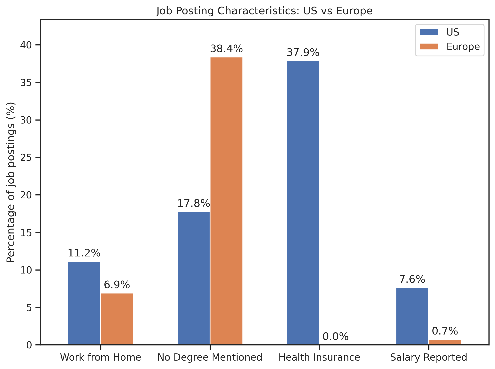
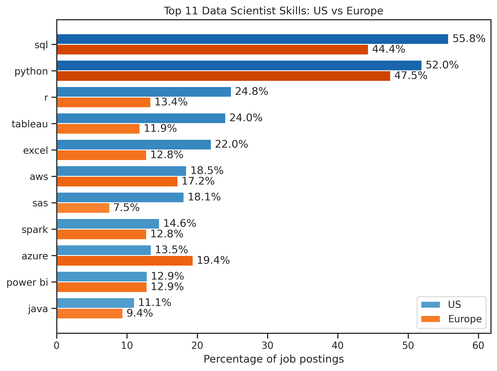
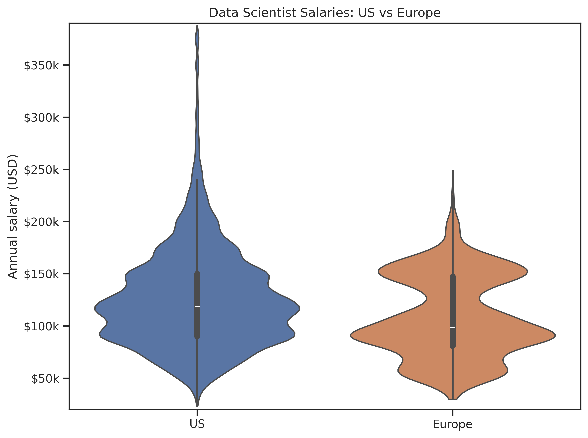
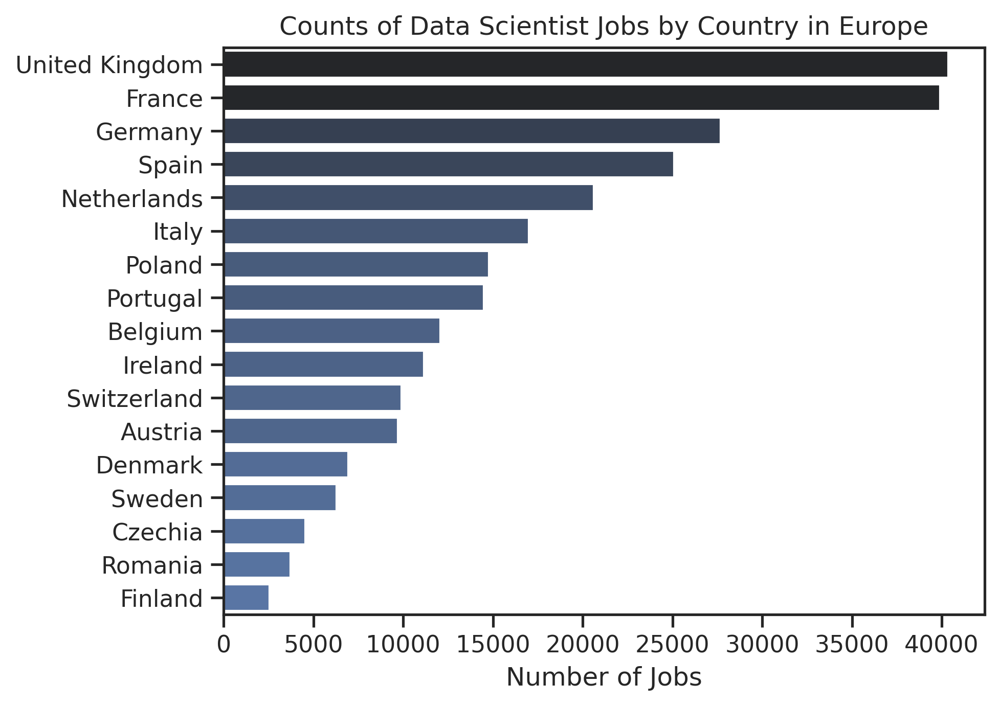
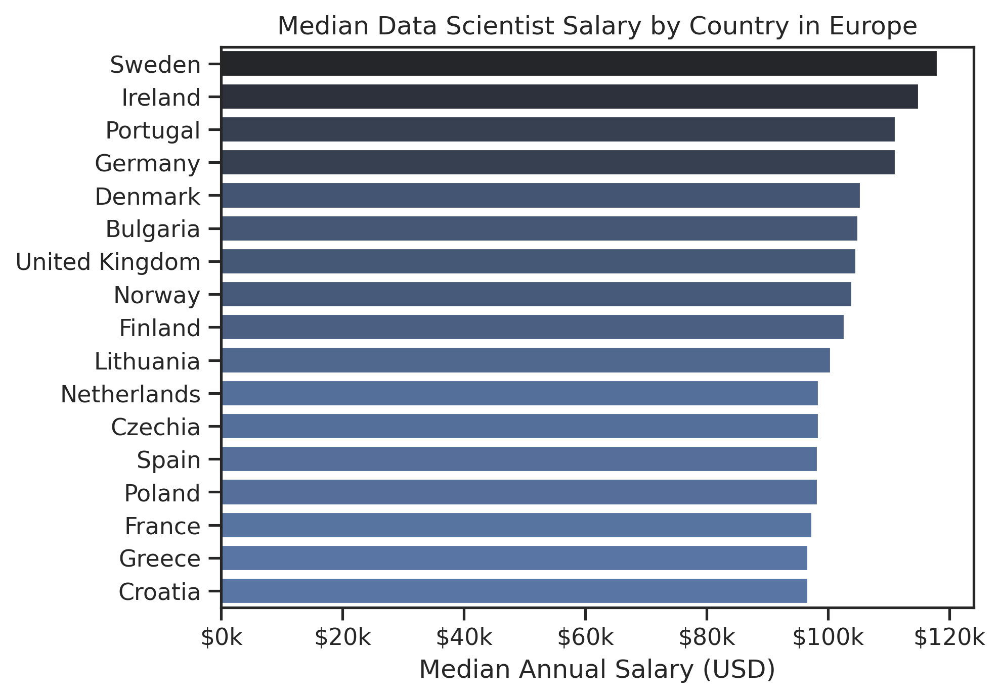
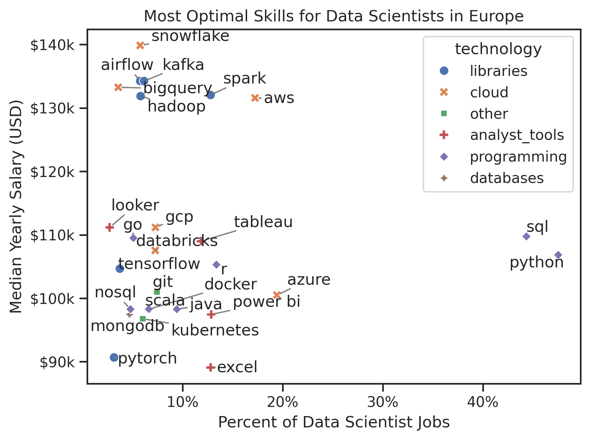

# Data Science Job Market Analysis

Analysis of Data Science job postings, focusing on skills, salaries, and differences between the US and European markets.

## Overview

This project explores the Data Science job market using a large dataset of job postings. The analysis focuses on three main questions:

1. How do Data Science job postings differ between the US and Europe?
2. Which skills are most frequently requested?
3. Which skills are associated with higher reported salaries?

The analysis is performed in Python using pandas, NumPy, Matplotlib, Seaborn, and Hugging Face Datasets.

## Dataset

The analysis uses the [Data Jobs dataset](https://huggingface.co/datasets/lukebarousse/data_jobs) collected and provided by Luke Barousse.

The dataset contains approximately 786,000 job postings and includes information about:

- Job titles and locations
- Job posting dates
- Work-from-home availability
- Degree requirements
- Health insurance
- Annual and hourly salaries
- Required skills
- Skill categories

A major limitation is that salary information is available for only a small fraction of the postings. Salary analyses therefore represent the subset of jobs for which salary information was reported.

## US vs Europe

The comparison examines job-posting characteristics, salary distributions, and skill requirements.

<p align="center">
   
</p>

### Main observations

- Work-from-home availability is more common in the US.
- In Europe it is more common to request a degree. 
- Health insurance is not a factor in Europe (consistent with a different health system).
- Salary information is reported for only a minority of job postings, remarkably less than 1% of all postings for Europe (!).
- US salaries are generally higher than European salaries in the reported salary data, although the distributions overlap substantially. In addition, the European market is not homogeneous: reported median salaries vary considerably between countries.

## Most Requested Skills

The following plot compares the most frequently requested skills in US Data Scientist job postings with their prevalence in European postings, where skill prevalence is calculated as the percentage of job postings mentioning a given skill.

The skills are ordered according to their prevalence in the US market.

<p align="center">
   
</p>

### Main observations

- Python and SQL are, by a very large margin, the most frequently requested skills in both markets.
- Cloud technologies and data-related tools are also prominent requirements.
- In the US, requesting typical Data Analyst skills (such as Tableau and Excel) is more common than in the European market, while in Europe azure is more relevant. 

## Salaries

Salary distributions are compared using annual salary information reported in the job postings.

<p align="center">
  
</p>

The salary distribution shows a higher reported salary level in the US market. Extreme US salary observations were excluded from the visualization to avoid compressing the main distribution.

Reported salaries should not be interpreted as representative of the complete job market because salary information is missing from most postings.

## European Salary Differences

The European market shows substantial variation in total number of job postings and the reported median salaries between countries.

<p align="center">
  
  
</p>

The number of salary observations should be considered alongside the median salary for each country, since some countries have substantially fewer reported salaries than others.


## Skills and Salary

The final analysis examines the relationship between how frequently a skill is requested and the median salary associated with postings mentioning that skill.

<p align="center">
   
</p>

Only skills with a minimum number of job postings and salary observations are considered in order to reduce the influence of very small samples.

We find a correlation between high salaries and requiring specific libraries (such as airflow and kafka) and cloud technologies (snowflake, bigquery, aws). Similarly, skills commonly found in Data Analyst jobs (such as power bi and excel) are associated with lower salaries.

Very important caveat: due to visualization limitations the dispersion of the median salaries (e.g. characterised by the 0.25-0.75 quartiles) are not shown, but they would show a very large spread, meaning that the perceived salary differences should be taken with care.

## Conclusions

The analysis suggests several broad patterns in the Data Science job market:

- **Python and SQL are fundamental skills** across both the US and European markets.
- **Cloud, data engineering, visualization, and machine-learning technologies** are also frequently requested, often correlating with higher salaries.
- The relative demand for individual skills differs between the two markets.
- **Reported US salaries are substantially higher** than reported European salaries, although salary reporting is incomplete (especially in the European market) and the markets are heterogeneous.
- Within Europe, **salary levels vary considerably by country**.
- Skills associated with higher median salaries tend to be less universally requested, illustrating a trade-off between **skill prevalence and salary association**.
- Salary differences should not be interpreted causally: the analysis does not control for seniority, industry, company, location, or other confounding variables.

## Tools

- Python
- pandas
- NumPy
- Matplotlib
- Seaborn
- Hugging Face Datasets
- adjustText

## Repository Structure

```text
.
├── figures/
│   ├── 01_job_posting_characteristics.png
│   ├── 02_top_skills_us_vs_europe.png
│   ├── 03_salary_us_vs_europe.png
│   ├── 04_counts_by_european_country.png
│   ├── 05_salary_by_european_country.png
│   └── 06_skills_salary_europe.png
├── job-market_analysis.ipynb
├── README.md
└── .gitignore
```
     
